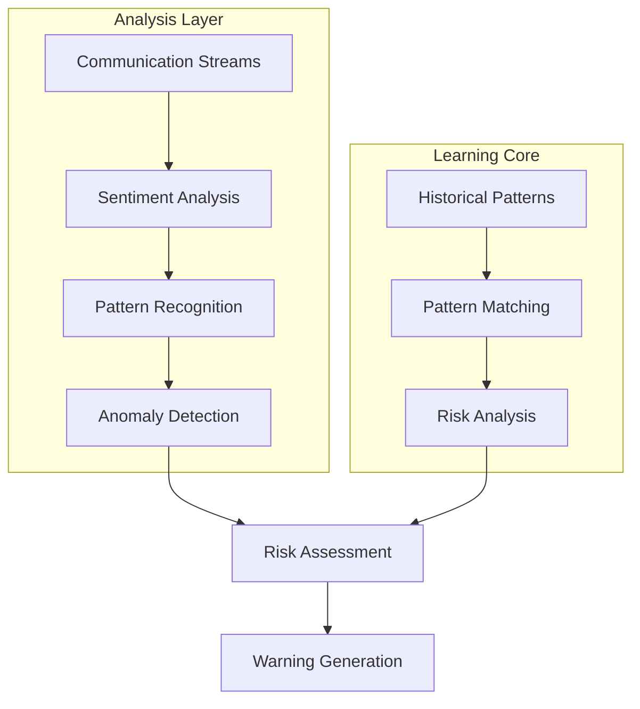
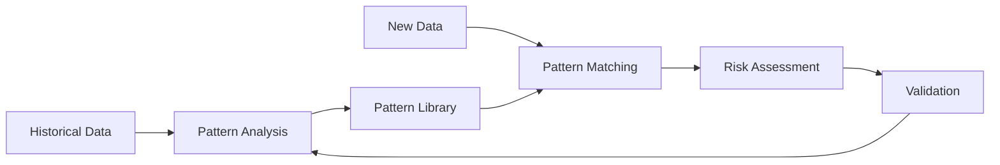

# GHEWS Architecture: Early Warning Through Communication Analysis

## Core Innovation

GHEWS introduces a new approach to pandemic detection by analyzing changes in communication patterns. Our hypothesis is that subtle shifts in how healthcare workers, communities, and officials communicate could indicate emerging health concerns before they become apparent through traditional metrics.

## Emotional Arc Intelligence

### Pattern Recognition System
- Analyzes communications in major world languages
- Compares current patterns against historical data
- Identifies potential anomalies in communication flows
- Learns from validated patterns

### Key Indicators We Monitor
1. **Healthcare Communication**
   - Changes in professional medical discussions
   - Shifts in terminology usage
   - Communication frequency changes

2. **Community Signals**
   - Social media sentiment changes
   - Public health discussions
   - Local concern patterns

3. **Regional Variations**
   - Cultural communication differences
   - Language-specific patterns
   - Regional response variations

## Technical Foundation

### Learning Engine

### Processing Capabilities
- Scalable communication analysis
- Support for major world languages
- Integration of available historical data
- Continuous learning from validated patterns

## Integration Goals

### WHO System Enhancement
- Designed to complement existing surveillance
- Provides additional early indicators
- Aims to integrate with health networks
- Supports decision-making processes

## Pattern Recognition

### Multi-Dimensional Analysis
1. **Temporal Analysis**
   - Pattern comparison
   - Trend analysis
   - Anomaly detection

2. **Geographic Correlation**
   - Regional pattern analysis
   - Cross-border monitoring
   - Cultural context consideration

3. **Language Processing**
   - Sentiment analysis
   - Context analysis
   - Emotion mapping

## Learning System

### Pattern Development
- Builds on available crisis communications data
- Incorporates new validated patterns
- Adjusts to regional variations
- Improves through expert validation

### Pattern Library
- Growing collection of communication patterns
- Cultural response variations
- Continuous refinement through validation

## Security Framework

### Data Protection
- Strong encryption
- Access controls
- Privacy protection
- Ethical data handling

### Compliance
- WHO guideline alignment
- Data protection compliance
- Healthcare data regulations
- Ethical AI guidelines

## Implementation Plan

### Phase 1: Foundation
- Initial pattern analysis
- Core language support
- Basic alert system
- Expert validation process

### Phase 2: Enhancement
- Extended pattern matching
- Additional language support
- Improved learning system
- Validation refinement

### Phase 3: Integration
- Health system integration
- Pattern library expansion
- Supervised operation
- Performance validation

## Future Development

### Research Areas
- Pattern recognition enhancement
- Language support expansion
- Prediction model development
- Cross-system integration

### Validation Focus
- Pattern accuracy assessment
- Alert timing validation
- False positive reduction
- Performance measurement

## Conclusion

GHEWS explores the potential of communication pattern analysis for earlier health crisis detection. While this approach is experimental, it could provide valuable additional indicators to complement existing surveillance systems. Our focus is on rigorous validation and continuous improvement through expert feedback and real-world testing.
