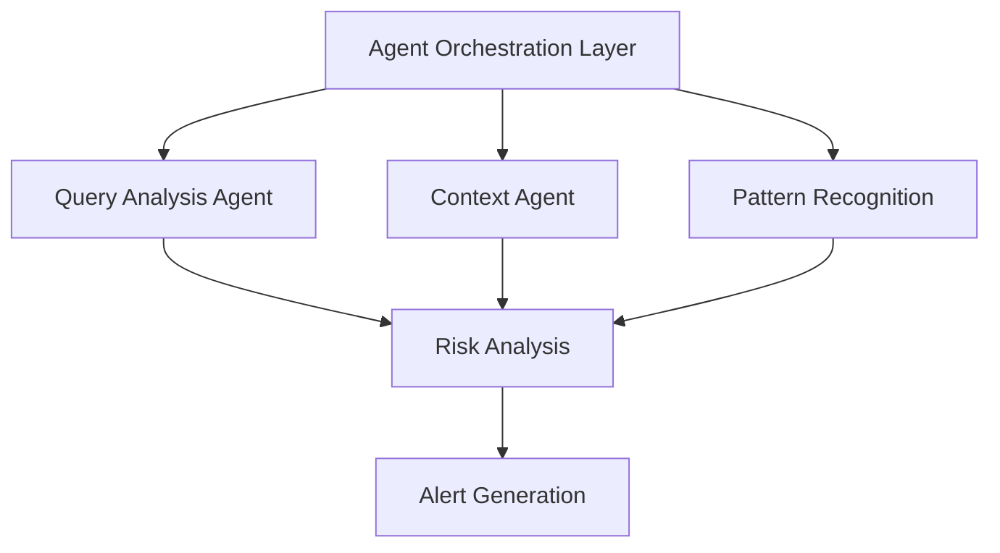

# Architecture

## Current System


## Core Components
1. **Agent Orchestration Layer**
   - Coordinates all agent interactions
   - Manages workflow sequences
   - Handles message routing

2. **Specialized Agents**
   - Pattern Recognition: Emotional arc analysis
   - Cultural Context: Regional analysis
   - Risk Assessment: WHO guideline integration
   - Alert Generation: Multi-language output

## Potential Fabric Integration

### Current Limitations
- Limited data processing scale
- Basic pattern recognition
- Standalone operation

### Fabric Enhancement Opportunities
1. **Data Processing**
   - Leverage Fabric's Data Factory for large-scale health data
   - Use Fabric's lakehouse for historical pattern storage
   - Implement real-time data streaming

2. **Analytics Enhancement**
   - Integrate Fabric's Analytics Engine
   - Use Synapse for complex pattern analysis
   - Implement predictive modeling with AutoML

3. **Operational Integration**
   ```mermaid
   graph TD
       A[Agent System] --> B[Fabric Data Lake]
       B --> C[Fabric Analytics]
       C --> D[Fabric ML Services]
       D --> E[Enhanced Pattern Recognition]
       E --> A
   ```

4. **Scale Benefits**
   - Global data processing capability
   - Enhanced pattern recognition
   - Real-time analytics
   - Enterprise-grade security

## Implementation Path
1. **Phase 1: Current System**
   - Multi-agent emotional arc analysis
   - WHO guideline integration
   - Basic pattern recognition

2. **Phase 2: Fabric Integration**
   - Data lake implementation
   - Analytics engine integration
   - ML model enhancement

3. **Phase 3: Enterprise Scale**
   - Global data processing
   - Real-time pattern detection
   - Advanced predictive capabilities

## Security and Compliance
- Azure AD integration
- Role-based access control
- Data sovereignty handling
- WHO compliance maintenance

## Future Considerations
1. **Additional AI Capabilities**
   - Advanced sentiment analysis
   - Predictive modeling
   - Anomaly detection

2. **Integration Points**
   - Power BI dashboards
   - Teams notifications
   - Mobile alerts

3. **Global Scale**
   - Multi-region deployment
   - Load balancing
   - Disaster recovery
